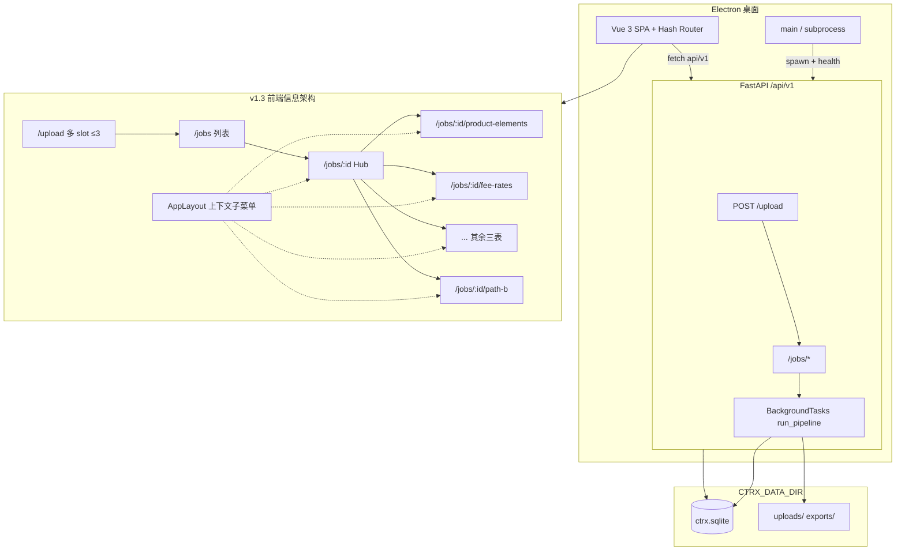
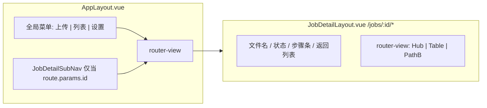

# Architecture Research — CTRX v1.3

**Domain:** Electron 桌面壳 + FastAPI + Vue 3 SPA（单用户、SQLite、每 docx 一 job）  
**Researched:** 2026-05-29  
**Confidence:** HIGH（基于 `PROJECT.md`、现有 `jobs`/`upload` 路由与前端实现直接推导）

**v1.3 目标（摘自 PROJECT.md）：** 一次最多上传 3 份 docx 并行解析；文件详情拆为 Hub 总览 + 左侧六页工作流（五张导入表 + 字段 B）；每页可编辑、摘录核对、单表下载。

**v1.2 基座不变：** Electron 主进程 → PyInstaller `ctrx-backend` → `http://127.0.0.1:{port}/api/v1/*`；数据目录 `CTRX_DATA_DIR`（SQLite + uploads/exports）。本文件只描述 v1.3 增量架构。

---

## 现状 vs 目标

| 维度 | v1.2（当前） | v1.3（目标） |
|------|-------------|-------------|
| 上传 | `POST /upload` 单文件；`UploadView` 一次一个 | 同 API 可并行调用 ≤3 次；上传页展示多 job 进度 |
| 详情路由 | `/jobs/:id` 单页 `JobDetail.vue` 堆叠所有面板 | `/jobs/:id` Hub + `/jobs/:id/{section}` 六子页 |
| 侧栏 | `AppLayout` 仅三项：上传 / 列表 / 设置 | 进入 job 上下文时显示**可折叠**「文件详情」子菜单（6 项） |
| 预览编辑 | `ExportPreview` 内 `el-tabs` 五表合一 | 每表独立路由页：编辑区 + 摘录列 + 单表下载 |
| 字段 B | `PathBPanel` 嵌在详情页底部 | 独立路由 `/jobs/:id/path-b`，强化摘录与页码 |
| 校验 | `ValidationPanel` 在详情页 | 保留在 **Hub**（全 job 级，不按表拆） |

---

## 系统结构（Mermaid）



### 详情区布局（嵌套路由）



**推荐：** `JobDetailLayout` 作为 `/jobs/:id` 的 **parent route**（`children`），子路由渲染在右侧主区；**子菜单挂在 `AppLayout` 侧栏**（与 v1.1 全局导航同级），通过 `route.params.id` 动态生成链接，避免双栏侧栏。

---

## 路由结构

### 全局路由（`frontend/src/router/index.ts`）

| 路径 | name | 组件 | 说明 |
|------|------|------|------|
| `/upload` | upload | `UploadView` | 多文件上传区（≤3） |
| `/jobs` | jobs | `FileListView` | 历史任务 |
| `/jobs/:id` | job-hub | `JobHubView` | **Hub**：摘要卡片 + 进入详情 |
| `/jobs/:id/product-elements` | job-product | `JobTableView` | 产品要素 |
| `/jobs/:id/fee-rates` | job-fee | `JobTableView` | 运营费率 |
| `/jobs/:id/lock-periods` | job-lock | `JobTableView` | 份额锁定期 |
| `/jobs/:id/share-classes` | job-share | `JobTableView` | 分级份额 |
| `/jobs/:id/subscription-fee-rates` | job-subscription | `JobTableView` | 申赎费率 |
| `/jobs/:id/path-b` | job-path-b | `JobPathBView` | 字段 B |
| `/settings` | settings | `SettingsView` | 不变 |

`section` 与现有 **download kind** 对齐，减少心智负担：

```typescript
// constants/jobSections.ts
export const JOB_SECTIONS = [
  { key: 'product-elements', label: '产品要素', previewKey: 'product' },
  { key: 'fee-rates', label: '运营费率', previewKey: 'fee' },
  { key: 'lock-periods', label: '份额锁定期', previewKey: 'lock' },
  { key: 'share-classes', label: '分级份额', previewKey: 'share' },
  { key: 'subscription-fee-rates', label: '申赎费率', previewKey: 'subscription' },
  { key: 'path-b', label: '字段 B', previewKey: null },
] as const
```

### 路由配置示意

```typescript
{
  path: '/jobs/:id',
  component: () => import('@/layouts/JobDetailLayout.vue'),
  props: true,
  children: [
    { path: '', name: 'job-hub', component: () => import('@/views/JobHubView.vue') },
    { path: 'product-elements', name: 'job-product', component: () => import('@/views/JobTableView.vue'), props: { section: 'product-elements' } },
    // ... 其余四表同 JobTableView + section prop
    { path: 'path-b', name: 'job-path-b', component: () => import('@/views/JobPathBView.vue') },
  ],
}
```

**重定向：** 旧书签 `/jobs/:id` 仍有效（默认 child = Hub）。从列表点「详情」→ `job-hub`。

**`activeMenu`（AppLayout）：**  
- `/jobs` 与 `/jobs/:id/*` 均高亮「文件列表」父项；  
- 子菜单 `default-active` = 当前完整 path（如 `/jobs/uuid/fee-rates`）。

---

## Hub vs 详情页职责

### Hub（`JobHubView`）

| 区块 | 数据来源 | 行为 |
|------|----------|------|
| 任务元信息 | `GET /jobs/{id}` | 文件名、状态、`ProcessStepper`、错误信息 |
| 操作 | 同上 + `POST .../run` | 开始/重试、删除（沿用 `JobDetail` 头部逻辑） |
| 五表摘要卡 | `GET /jobs/{id}/preview` 或 **分片 API**（见下） | 行数、关键字段抽样、校验 fail 数（按表可选） |
| 字段 B 摘要 | `GET /jobs/{id}/path-b` | 业绩报酬/开放日一句摘要 +「进入字段 B」 |
| 校验总览 | `GET /jobs/{id}/validation` | 折叠 `ValidationPanel`（全 job，不拆页） |
| 警告列表 | `JobDetail.extraction_warnings` | `WarningsList` |

Hub **不放**可编辑大表格，避免与六页重复；仅摘要 + `router-link` 到子路由。

### 表详情页（`JobTableView`）

| 区块 | 说明 |
|------|------|
| 可编辑网格 | 从 `ExportPreview` 拆出的单 tab 逻辑（`product` / `fee` / …） |
| 摘录核对表 | 列含「字段/值/页码/摘录原文」— 产品要素用 `product_rows`；列表表用 `摘录原文` 列（已有 `SNIPPET_DISPLAY`） |
| 保存 | `PUT` 分表或全量 preview（见 API） |
| 下载 | 现有 `downloadBlob(jobId, kind, filename)`，kind 与路由 section 一致 |

### 字段 B 页（`JobPathBView`）

- 数据：`GET /jobs/{id}/path-b`（不变）  
- UI：自 `PathBPanel` 抽出；表格列：**标签 / 建议值 / 页码（若 raw_sections 或 snippet meta 有）/ 原文摘录**  
- 无 xlsx 下载（手录 CRM）；可选保留「下载核对报告」链到 Hub。

---

## API 变更

### 保持不变（直接复用）

| 方法 | 路径 | 用途 |
|------|------|------|
| POST | `/upload` | 每文件一次，创建 `pending` job |
| GET | `/jobs` | 列表 |
| GET | `/jobs/{id}` | Hub / 轮询状态 |
| POST | `/jobs/{id}/run` | 后台 `run_pipeline` |
| DELETE | `/jobs/{id}` | 删除 |
| GET | `/jobs/{id}/download/{kind}` | 五表单文件下载（kind 已存在） |
| GET | `/jobs/{id}/path-b` | 字段 B |
| GET | `/jobs/{id}/validation` | LLM 校验 |
| GET | `/jobs/{id}/download/review-report` | 核对报告 |

### 建议新增（v1.3）

| 方法 | 路径 | 目的 | 优先级 |
|------|------|------|--------|
| GET | `/jobs/{id}/preview/{section}` | `section` ∈ `product-elements` \| `fee-rates` \| …；只返回该表 JSON | **推荐** — 减小六页重复拉全量 preview |
| PUT | `/jobs/{id}/preview/{section}` | 分表保存；服务端 merge 进 `extraction_result` 再 `persist_export` | **推荐** — 避免并行编辑互相覆盖 |
| GET | `/jobs/concurrency` 或在 list 响应加字段 | `{ active: n, max: 3 }` 供上传页禁用第 4 个文件 | **推荐** |
| POST | `/upload/batch` | multipart 最多 3 文件，返回 `job_ids[]` | 可选 — 客户端 3×POST 亦可 |

**`section` 与 `preview_edit_service` 映射：**

| section URL | PUT body 字段 | extraction 键 |
|-------------|---------------|----------------|
| `product-elements` | `product_rows` | `product_elements` |
| `fee-rates` | `fee_columns`, `fee_rows` | `fee_rates` |
| `lock-periods` | `lock_*` | `lock_periods` |
| `share-classes` | `share_*` | `share_classes` |
| `subscription-fee-rates` | `subscription_*` | `subscription_fee_rates` |

实现：在 `preview_service.build_job_preview` 上增加 `slice_preview(data, section)`；`apply_preview_edits` 增加 `sections: list[str] | None`，仅 merge 指定块。

### 并行上传与 pipeline（后端约束）

**模型：** 每 docx = 一条 `ContractFile` + 独立 `BackgroundTasks.run_pipeline(job_id)`（已满足「每文件独立 job」）。

**新增守门（`pipeline_service` 或 `upload_service`）：**

```python
MAX_CONCURRENT_PIPELINES = 3
IN_PROGRESS = frozenset({"parsing", "extracting", "exporting"})

def count_in_progress() -> int:
    # SELECT COUNT(*) WHERE status IN IN_PROGRESS
```

- `POST /jobs/{id}/run`：若 `count_in_progress() >= 3` 且本 job 非已在跑 → **409** `Too many jobs in progress (max 3)`  
- 可选：`POST /upload` 在 `pending` 且未 run 时不计入；仅 **in-progress** 计入，与 PROJECT「并行解析」一致  

**SQLite：** 保持 WAL + `check_same_thread=False`；三 job 并行主要为 CPU/LLM IO，非连接池扩展问题。

**LLM 校验：** 仍 job 级；三 job 同时 extract 时校验可能排队 — v1.3 可接受，v2 再考虑队列。

### 无需改的 API

- 不必为每表新增 download 路径（已有五类 `download/*`）  
- Path B 不必 PUT（只读摘录 + 手录）

---

## 前端组件边界

| 组件 | 职责 | 新建/改 |
|------|------|---------|
| `AppLayout.vue` | 全局侧栏 + **条件渲染** `JobDetailSubMenu` | 修改 |
| `JobDetailSubMenu.vue` | `el-sub-menu` 六链接，`index`=`/jobs/${id}/${section}` | 新建 |
| `JobDetailLayout.vue` | 公共头（poll、`useJobPoll`、删除）+ `<router-view>` | 新建 |
| `JobHubView.vue` | 摘要卡片 + ValidationPanel + WarningsList | 新建 |
| `JobTableView.vue` | 单表编辑+摘录+保存+下载；props: `section` | 新建 |
| `JobPathBView.vue` | 字段 B 全文摘录 UI | 新建 |
| `ExportPreview.vue` | 拆逻辑后 **废弃或仅 dev** | 弃用/薄封装 |
| `JobDetail.vue` | 逻辑上移至 Layout + Hub + Table | 逐步删除 |
| `UploadView.vue` | `el-upload` `limit=3`、多 job 卡片、批量 run | 修改 |
| `useJobPoll.ts` | 支持 `jobIds: Ref<string[]>` 或每卡独立 composable | 修改 |

**轮询：** Hub 与 Layout 各 poll 同一 `jobId` 时，用 **provide/inject** 或 layout 内单一 poll 下发 `detail`，避免六页 6 路重复请求。

---

## 数据流：多文件上传 → 并行解析

```
用户选 1–3 个 docx
  → 并行 POST /upload (×n)
  → 得到 job_ids[]
  → 对每个 id: POST /jobs/{id}/run（若未满 3 路 in-progress）
  → UploadView 每卡 useJobPoll / 共享 poll registry
  → 完成 → 跳转 /jobs/{id} Hub 或留在上传页批量「查看」
```

```
用户从列表进入 /jobs/{id}
  → JobDetailLayout GET /jobs/{id} + poll
  → Hub 拉 preview 摘要 + path-b 摘要 + validation
  → 用户点子菜单 /jobs/{id}/fee-rates
  → JobTableView GET /jobs/{id}/preview/fee-rates
  → 编辑 → PUT .../preview/fee-rates → persist_export（仅该表相关 xlsx）
  → 下载 → GET .../download/fee-rates
```

---

## 反模式（v1.3 规避）

| 反模式 | 后果 | 做法 |
|--------|------|------|
| 六页各 `PUT` 全量 preview | 后写覆盖先写 | 分表 PUT + 服务端 merge |
| 子菜单放在 JobDetailLayout 内第二栏 | 与全局侧栏重复、窄屏更挤 | 子菜单只在 AppLayout |
| Hub 嵌入完整 ExportPreview | 与 v1.3「总览仅入口」冲突 | Hub 仅卡片摘要 |
| 第四路 pipeline 无守门 | SQLite/LLM 打满、机器卡顿 | `MAX_CONCURRENT=3` 409 |
| 每子页独立 poll `getJob` | 6× 轮询流量 | Layout 单 poll provide |

---

## 构建顺序（推荐 5 步）

实施顺序按**依赖从底到顶**排列，便于每步可测：

1. **后端并行守门 + 分表 Preview API**  
   - `count_in_progress` + `run` 409；`GET/PUT /jobs/{id}/preview/{section}`；pytest 覆盖 merge 与并发上限。  
   - *验收：* 第四路 run 被拒；分表 PUT 只改一张表。

2. **路由骨架与 JobDetailLayout**  
   - 嵌套 `children`、Hub 占位、`JobDetailSubMenu` 静态链接；从列表/上传跳转 Hub。  
   - *验收：* `/jobs/:id` 与 `/jobs/:id/fee-rates` 可导航，头部状态一致。

3. **单表详情页（JobTableView）**  
   - 从 `ExportPreview` 抽出五表；接分表 GET/PUT；单表下载按钮。  
   - *验收：* 编辑费率保存后仅 fee xlsx 更新，其他表不变。

4. **Hub 摘要 + 字段 B 页**  
   - `JobHubView` 卡片 + ValidationPanel；`JobPathBView` 摘录/页码表。  
   - *验收：* Hub 无大表格；Path B 与旧 Panel 信息等价。

5. **上传页多文件（≤3）+ 并行 run/轮询**  
   - `UploadView` 多 slot、并发 upload/run、进度卡；对接 concurrency API。  
   - *验收：* 三份合同同时解析，第四份上传或 run 被 UI/API 拒绝。

*可选第 6 步（收尾）：* 删除单体 `JobDetail.vue` / `ExportPreview` 死代码；更新 UAT 与 `FIELD_SPEC` 运营说明。

---

## 与路线图阶段映射（建议）

| Phase 主题 | 构建步 |
|------------|--------|
| 并行上传 ≤3 | 步 1 + 步 5 |
| Hub + 侧栏子菜单 | 步 2 + 步 4 |
| 五表独立页 | 步 3 |
| 字段 B 页 | 步 4 |

---

## 置信度与缺口

| 项 | 置信度 | 说明 |
|----|--------|------|
| 路由与 download kind 对齐 | HIGH | 代码已存在五类 download |
| 分表 preview API | MEDIUM | 推荐但非强制；全量 GET/PUT 亦可 MVP，有覆盖风险 |
| 并发计数仅 in-progress | MEDIUM | 需与产品确认 pending 是否占槽 |
| 页码列来源 | MEDIUM | 需核对 `extraction_result` 是否含 page；若无则 v1.3 仅摘录文本 |

**Phase 级深研标记：** 若 `extraction` 无统一 page 字段，字段 B/产品表「页码」列需 Phase 规划补抽取元数据。

---

## Sources

- `contract_info/.planning/PROJECT.md` — v1.3 milestone 目标  
- `contract_info/frontend/src/router/index.ts` — 当前路由  
- `contract_info/frontend/src/layouts/AppLayout.vue` — 侧栏结构  
- `contract_info/frontend/src/components/JobDetail.vue`, `ExportPreview.vue` — 待拆分 UI  
- `contract_info/backend/app/api/routes/jobs.py`, `upload.py` — 现有 API  
- `contract_info/backend/app/services/pipeline_service.py`, `preview_edit_service.py` — pipeline 与编辑 merge  
- `contract_info/.planning/v1.1-FRONTEND-NAV.md` — v1.1 导航先例  

---
*Architecture research for: CTRX v1.3 — 多文件并行与详情页重构*  
*Researched: 2026-05-29*
